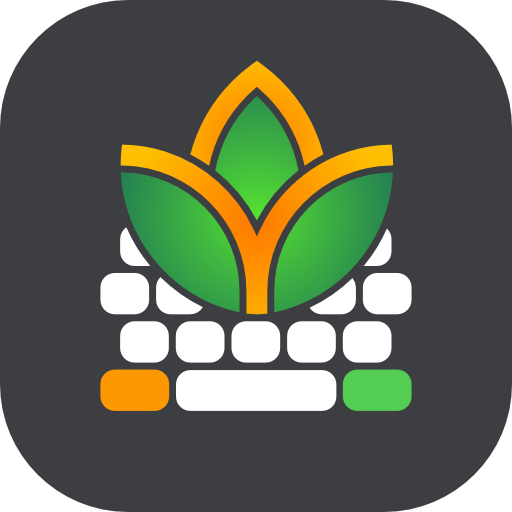

# FlorisBoard [](https://crowdin.florisboard.patrickgold.dev) [](https://matrix.to/#/#florisboard:matrix.org) [](CODE_OF_CONDUCT.md) 

**FlorisBoard** is a free and open-source keyboard for Android 7.0+
devices. It aims at being modern, user-friendly and customizable while
fully respecting your privacy. Currently in early-beta state.

<table>
<tr>
<th align="center" width="50%">
<h3>Stable <a href="https://github.com/florisboard/florisboard/releases/latest"></a></h3>
</th>
<th align="center" width="50%">
<h3>Beta <a href="https://github.com/florisboard/florisboard/releases"></a></h3>
</th>
</tr>
<tr>
<td valign="top">
<p><i>Major versions only</i><br><br>Updates are more polished, new features are matured and tested through to ensure a stable experience.</p>
</td>
<td valign="top">
<p><i>Alpha/Beta versions</i><br><br>Updates contain new features that may not be fully matured yet and bugs are more likely to occur. Allows you to give early feedback.</p>
</td>
</tr>
<tr>
<td valign="top">
<p><a href="https://f-droid.org/packages/dev.patrickgold.florisboard"></a></p>
<p>

**Google Play**: Join the [FlorisBoard Test Group](https://groups.google.com/g/florisboard-public-alpha-test), then visit the [testing page](https://play.google.com/apps/testing/dev.patrickgold.florisboard). Once joined and installed, updates will be delivered like for any other app. ([Store entry](https://play.google.com/store/apps/details?id=dev.patrickgold.florisboard))

</p>
<p>

**Manual**: Download and install the APK from the release page.

</p>
</td>
<td valign="top">
<p><a href="https://apt.izzysoft.de/fdroid/index/apk/dev.patrickgold.florisboard.beta"></a></p>
<p>

**Google Play**: Join the [FlorisBoard Test Group](https://groups.google.com/g/florisboard-public-alpha-test), then visit the [beta testing page](https://play.google.com/apps/testing/dev.patrickgold.florisboard.beta). Once joined and installed, updates will be delivered like for any other app. ([Store entry](https://play.google.com/store/apps/details?id=dev.patrickgold.florisboard.beta))

</p>
<p>

**Manual**: Download and install the APK from the release page.

</p>
</td>
</tr>
</table>

Beginning with v0.4.0 FlorisBoard will follow [SemVer](https://semver.org/#summary) versioning scheme.
Beginning with v0.6.0 FlorisBoard will enter the public beta on Google Play.

## Highlighted features
- Integrated clipboard manager / history
- Advanced theming support and customization
- Integrated extension support (still evolving)
- Emoji keyboard

> [!IMPORTANT]
> Word suggestions/spell checking are not included in the current releases
> and are a major goal for the v0.5 milestone.

Feature roadmap: See [ROADMAP.md](ROADMAP.md)

## Contributing
Want to contribute to FlorisBoard? That's great to hear! There are lots of
different ways to help out, please see the [contribution guidelines](CONTRIBUTING.md) for more info.

## Addons Store
The official [Addons Store](https://beta.addons.florisboard.org) offers the possibility for the community to share and download FlorisBoard extensions.
Instructions on how to publish addons can be found [here](https://github.com/florisboard/florisboard/wiki/How-to-publish-on-FlorisBoard-Addons).

Many thanks to Ali ([@4H1R](https://github.com/4H1R)) for implementing the store!

> [!NOTE]
> During the initial beta release phase, the Addons Store _will_ only accept theme extensions.
> Later on we plan to add support for language packs and keyboard extensions.

## List of permissions FlorisBoard requests
Please refer to this [page](https://github.com/florisboard/florisboard/wiki/List-of-permissions-FlorisBoard-requests)
to get more information on this topic.

## Used libraries, components and icons
* [AndroidX libraries](https://github.com/androidx/androidx) by
  [Android Jetpack](https://github.com/androidx)
* [AboutLibraries](https://github.com/mikepenz/AboutLibraries) by
  [mikepenz](https://github.com/mikepenz)
* [Google Material icons](https://github.com/google/material-design-icons) by
  [Google](https://github.com/google)
* [JetPref preference library](https://github.com/patrickgold/jetpref) by
  [patrickgold](https://github.com/patrickgold)
* [KotlinX coroutines library](https://github.com/Kotlin/kotlinx.coroutines) by
  [Kotlin](https://github.com/Kotlin)
* [KotlinX serialization library](https://github.com/Kotlin/kotlinx.serialization) by
  [Kotlin](https://github.com/Kotlin)

Many thanks to [Nikolay Anzarov](https://www.behance.net/nikolayanzarov) ([@BloodRaven0](https://github.com/BloodRaven0)) for designing and providing the main app icons to this project!

## License
```
Copyright 2020-2024 Patrick Goldinger

Licensed under the Apache License, Version 2.0 (the "License");
you may not use this file except in compliance with the License.
You may obtain a copy of the License at

http://www.apache.org/licenses/LICENSE-2.0

Unless required by applicable law or agreed to in writing, software
distributed under the License is distributed on an "AS IS" BASIS,
WITHOUT WARRANTIES OR CONDITIONS OF ANY KIND, either express or implied.
See the License for the specific language governing permissions and
limitations under the License.
```
