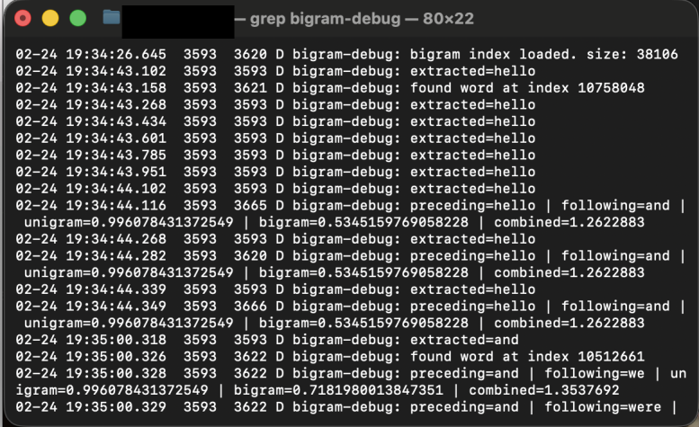
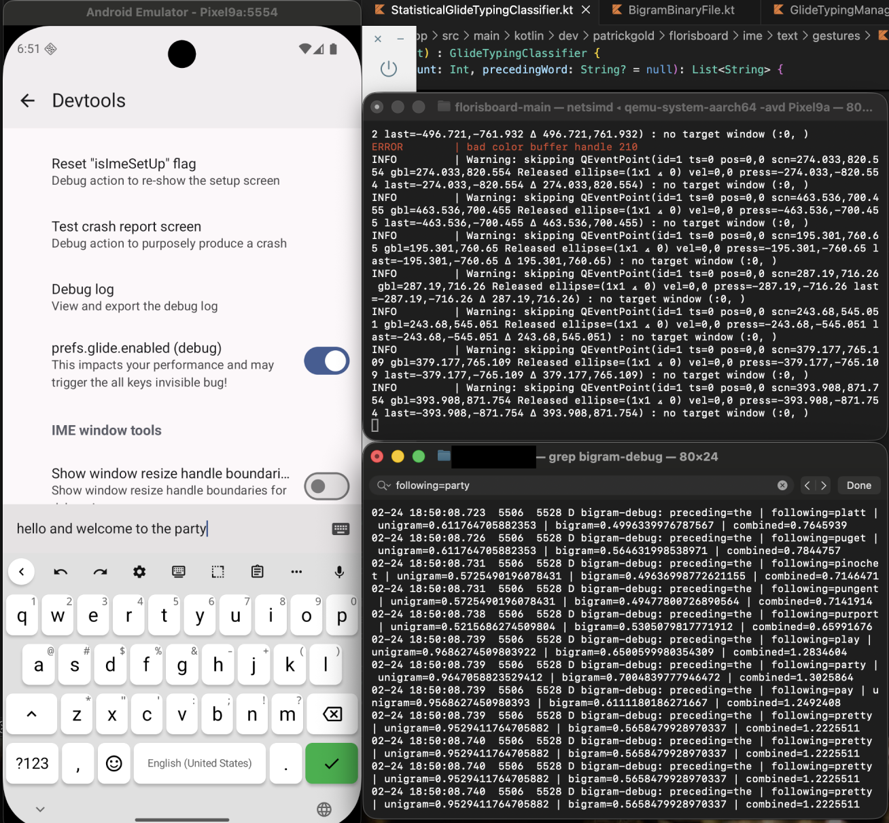
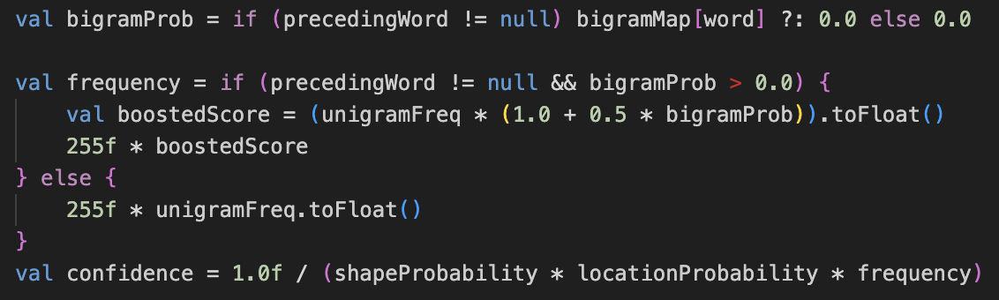

# Context-Aware Glide Typing Using Bigrams

## Overview

This fork implements bigram-based context awareness for swipe typing. It extracts the preceding word from the editor context, retrieves bigram probabilities through from the binary-based bigram dataset, and contributes a 0-50% boost for the frequency variable. Data is taken from Google's public ngram datasets released in 2020.

**Example:** During the start of the app, the program loads the the binary index into memory. When a precedingWord is extracted, it walks the index until it finds the position of that word.

**Example:** Here you can see logging output next to an emulated android device. The screen says "Hello and welcome to the party". As you can see on the bottom right, debugging output shows how the scores are calculated. 

`bigram-debug: preceding=the | following=party | unigram=0.9647058823529412 | bigram=0.7004839777946472 | combined=1.3025864`

This shows how the words frequency in its context has boosted the score to a combined `1.3025864`. After being multiplied by 255, the final score for the frequency value in the confidence equation will be `332.159532`. This leads to a lower confidence score, which leads to the word being higher in the rankings.

**Example:** Here you can see how bigramProb is used to calculate the frequency, which is then passed into the confidence equation.

---

# Changelog

## Core Changes

1. **Context Extraction** - Extract preceding word from editor using BreakIterator to identify word boundaries.

2. **Scoring Integration** - Modified glide typing scoring to accept preceding word context. Applied multiplicative boost formula: `score = unigram * (1.0 + 0.5 * bigram)` instead of averaging.

3. **Interface Updates** - Added `getBigramProbabilities()` method to SuggestionProvider interface with backward-compatible defaults.

## Data Storage Evolution

- **v1**: JSON file loaded into memory → OOM crashes
- **v2**: SQLite/Room database → Query latency issues  
- **v3**: Memory-mapped binary format (current) → Fast O(log n) lookups via binary search

## Optimizations

- LRU cache (size 2000) for bigram lookups
- Batch fetching all bigrams for word1 before scoring loop
- Pre-normalized probability values (0.0-1.0 range)
- Float32 instead of Float64 for binary storage
