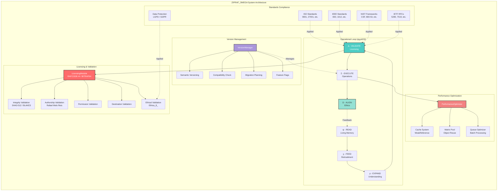

# ZIPRAF_OMEGA System Architecture

```mermaid
graph TB
    subgraph "ZIPRAF_OMEGA System Architecture"
        direction TB
        
        subgraph "Licensing & Validation"
            LM[LicensingModule<br/>RAFCODE-Φ / BITRAF64]
            V1[Integrity Validation<br/>SHA3-512 / BLAKE3]
            V2[Authorship Validation<br/>Rafael Melo Reis]
            V3[Permission Validation]
            V4[Destination Validation]
            V5[Ethical Validation<br/>Ethica_8_]
            
            LM --> V1
            LM --> V2
            LM --> V3
            LM --> V4
            LM --> V5
        end
        
        subgraph "Operational Loop (ψχρΔΣΩ)"
            PSI[ψ - READ<br/>Living Memory]
            CHI[χ - FEED<br/>Retroaliment]
            RHO[ρ - EXPAND<br/>Understanding]
            DELTA[Δ - VALIDATE<br/>Licensing]
            SIGMA[Σ - EXECUTE<br/>Operations]
            OMEGA[Ω - ALIGN<br/>Ethics]
            
            PSI --> CHI
            CHI --> RHO
            RHO --> DELTA
            DELTA --> SIGMA
            SIGMA --> OMEGA
            OMEGA -.Feedback.-> PSI
        end
        
        subgraph "Performance Optimization"
            PO[PerformanceOptimizer]
            CACHE[Cache System<br/>WeakReference]
            POOL[Matrix Pool<br/>Object Reuse]
            QUEUE[Queue Optimizer<br/>Batch Processing]
            
            PO --> CACHE
            PO --> POOL
            PO --> QUEUE
        end
        
        subgraph "Version Management"
            VM[VersionManager]
            SV[Semantic Versioning]
            COMPAT[Compatibility Check]
            MIG[Migration Planning]
            FEAT[Feature Flags]
            
            VM --> SV
            VM --> COMPAT
            VM --> MIG
            VM --> FEAT
        end
        
        subgraph "Standards Compliance"
            ISO[ISO Standards<br/>9001, 27001, etc.]
            IEEE[IEEE Standards<br/>830, 1012, etc.]
            NIST[NIST Frameworks<br/>CSF, 800-53, etc.]
            IETF[IETF RFCs<br/>5280, 7519, etc.]
            DP[Data Protection<br/>LGPD / GDPR]
            
            ISO -.Applied.-> DELTA
            IEEE -.Applied.-> DELTA
            NIST -.Applied.-> DELTA
            IETF -.Applied.-> DELTA
            DP -.Applied.-> V5
        end
        
        DELTA --> LM
        SIGMA --> PO
        VM -.Manages.-> SIGMA
    end
    
    style LM fill:#FF6B6B,stroke:#333,stroke-width:2px,color:#fff
    style DELTA fill:#4ECDC4,stroke:#333,stroke-width:2px,color:#fff
    style OMEGA fill:#95E1D3,stroke:#333,stroke-width:2px
    style PO fill:#F38181,stroke:#333,stroke-width:2px,color:#fff
    style VM fill:#AA96DA,stroke:#333,stroke-width:2px,color:#fff
```

---

**Author:** Rafael Melo Reis  
**Version:** v999  
**License:** Apache 2.0 (with authorship preservation)  

Amor, Luz e Coerência ✨
